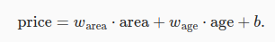
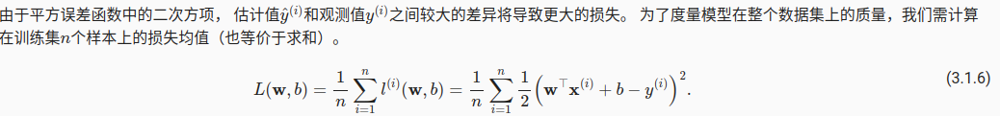
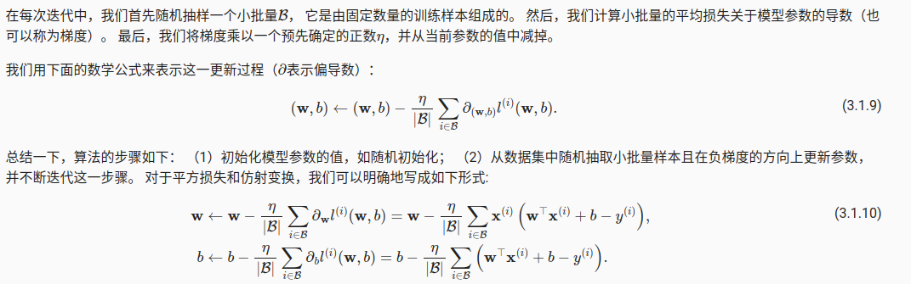
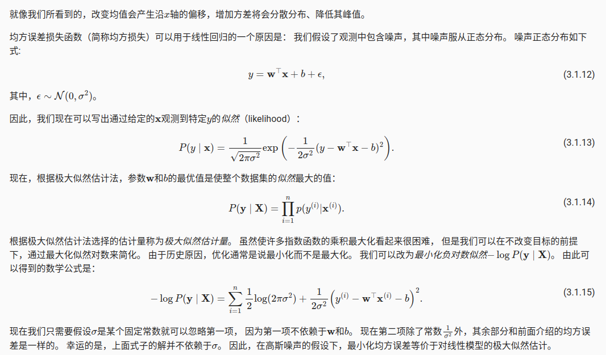
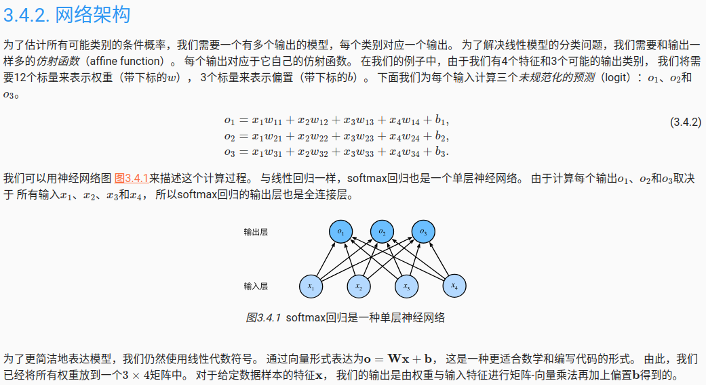

# 线性回归神经网络
 线性回归是深度学习中比较简单的模型了。当描述一个自变量和因变量的关系函数为线性时，y=ax+b.那么这就是一维的线性问题
 当多个自变量和因变量的关系 y = b+w_1*x1+w_2*x2+w_3*3那么就是多维的线性回归问题。
 通常在预测任务有关。不是所有的预测都是线性回归问题，比如典型的分类问题，就是对预测的数据属于哪一类别。
# 线性模型
  图1
 从图1可以看到，我们定义了一个线性模型
 网络需要学习的w权重矩阵和b偏置矩阵

# 损失函数
 
 
 # 随机梯度下降
 我们知道对于复杂的模型，向上面定义的损失函数不一定有解。但是我们可以通过梯度下降，使得不断在损失函数递减的方向上来更新参数来降低误差
 想象损失函数就是一个二次函数，我们向要找到最小值，但是这个值比较难确定，于是我们用梯度下降的方法来降低误差。
 * 梯度下降 损失函数对模型参数的导数，但是我们知道模型的参数可能是巨大，这对求导来说是恐怖的。于是我们引入了小批量随机梯度下降。于是这个小批量就定义为batch_size.下图展示了随机初始化模型参数，并且通过随机梯度下降来更新模型参数
 

 # 预测

 # 最大似然估计
 

 # 全连接层
 每个输入都与输出相连。如何理解每个输入都与输出相连？ 
 y = w_1 * x1 + w_2 * x2 
 x1,x2也称为特征维度

 # softmax回归
    上一节的回归问题预测了因变量的值(多少)，但是在分类问题，我们定义[0,1,2]三类，我们关心的是哪一类。
 实际上是我们关心样本是哪一类，但是我们通过数学上的概率来表示为哪一类。比如 两个类别[猫，狗],[0.3,0.5] 小于0.3的概率为猫，大于0.5的概率为狗
 ## 独热编码
 现在我们有三个类别[猫，鸡，狗]，y{1,2,3} 好像是非常自然的想法。我们引入独热编码
 y[[1,0,0],[0,1,0],[0,0,1]]类别对应的设置为1，其他设置为0
 ## 网络架构
 可以从这个网络架构看出，softmax回归也是全连接层
 
 ## softmax 
    就是确保没有负的概率,并且概率总和为1