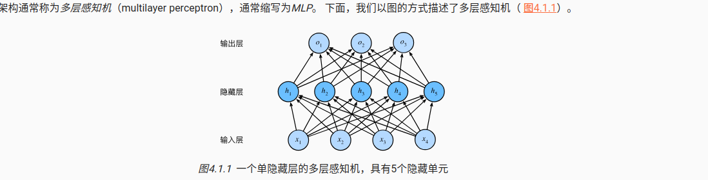

# 多层感知机

从上图可以看到，多了很多隐藏层，但是每个输入都连接到了隐藏层的输出，于是这是一个全连接层。全连接层都是线性的。y=wx+b
于是我们在这里面引入激活函数么，产生更有能力的表达模型
# 激活函数
## ReLU()激活函数
负数为0，正数斜率为1
## Sigmoid函数
0,1之间的数
## tanh函数
中心对称.-1,1
# 模型选择，欠拟合和过拟合
## 权重衰减来防止过拟合